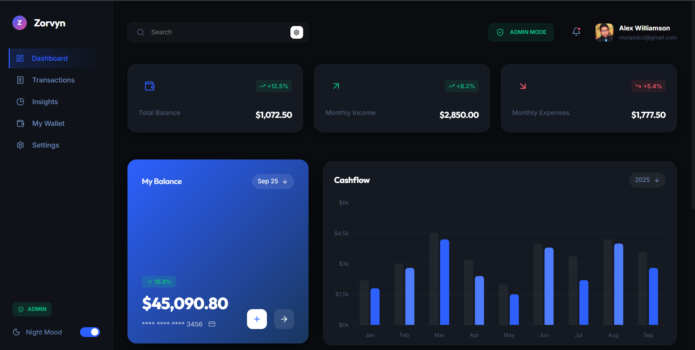
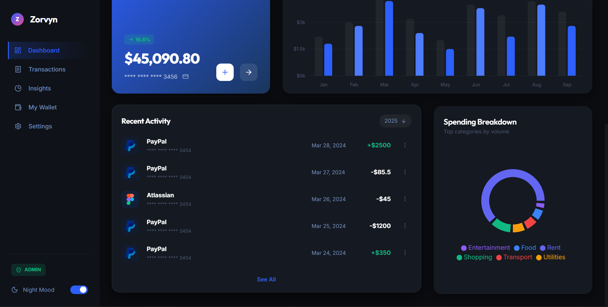
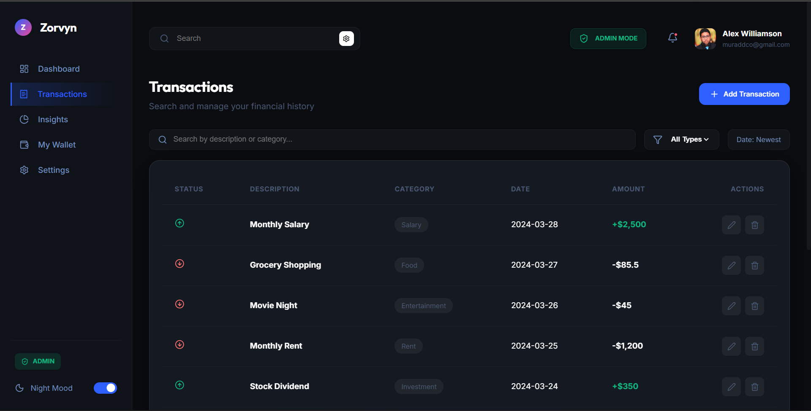
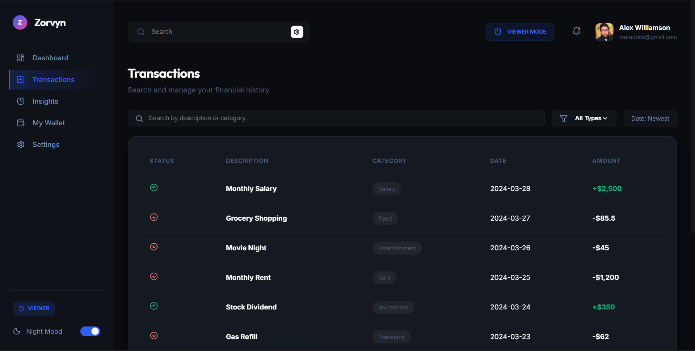
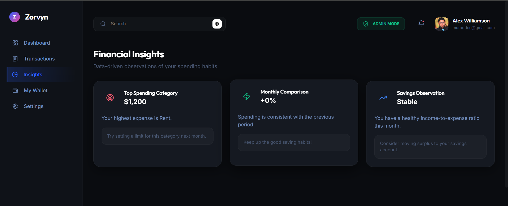

# Zorvyn Finance Dashboard

A premium, interactive personal finance management dashboard built with React, TypeScript, and Vite. Optimized for evaluation with clear role simulation, automated insights, and data persistence.

**Live Demo:** [https://zorvyn-ui.vercel.app/](https://zorvyn-ui.vercel.app/)

---

## ✅ Requirement Checklist & Implementation

### 1. Dashboard Overview

- **Summary Cards**: Dynamic Total Balance, Monthly Income, and Monthly Expenses cards with trend indicators.
- **Time-based Visualization**: **Cashflow Bar Chart** showing weekly patterns.
- **Categorical Visualization**: **Spending Breakdown** (Donut Chart) highlighting distribution across categories like Food, Shopping, and Entertainment.

### 2. Transactions Section

- **Comprehensive List**: Date, Amount ($), Category, and Type (Income/Expense).
- **Functional Controls**: Full-text **Search**, **Category Filtering**, and **Date Sorting** (Newest/Oldest).
- **Actionable Rows**: Admins can edit or delete any entry directly from the list.

### 3. Basic Role-Based UI (RBAC)

- **Role Switcher**: A prominent toggle in the TopBar allows reviewers to switch between **Admin** and **Viewer** modes instantly.
- **Gated Permissions**:
  - **Viewer**: Read-only access. "Add Transaction" and "Edit/Delete" actions are hidden.
  - **Admin**: Full CRUD capabilities enabled.

### 4. Insights Section

- **Logical Observations**: Dedicated view calculating:
  - **Highest Spending Category**: Identified from real-time transaction data.
  - **Monthly Comparison**: Percentage increase/decrease compared to the previous period.
  - **Smart Tips**: Contextual advice based on current ratios.

### 5. State Management

- **React Context API**: Centralized `FinanceContext.tsx` handles all global states (transactions, filters, roles) without prop-drilling.
- **Clean Architecture**: Modularity across components ensured via custom hooks (`useFinance`).

### 6. UI/UX Excellence

- **Premium Aesthetics**: "Zorvyn Deep Dark" theme featuring glassmorphism and subtle micro-animations.
- **Responsiveness**: Fluid layout using CSS Grid that adapts from ultra-wide monitors to mobile viewports.
- **Empty States**: Custom placeholders for graphs and lists when no data is available.

---

## 🚀 Setup Instructions

1. **Install Dependencies**
   ```bash
   npm install
   ```
2. **Run Development Server**
   ```bash
   npm run dev
   ```
3. **Build for Production**
   ```bash
   npm run build
   ```

## Data Handling

- Uses mock data stored in frontend
- No backend integration required
- Optional persistence handled via localStorage

## Screenshots

- Dashboard Overview
- Transactions Table
- Role Switching
- Insights Section






